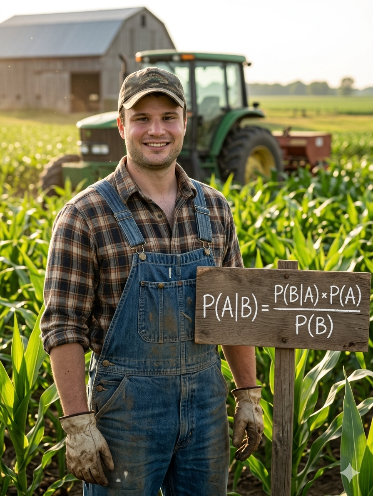

  <a href="index.html">Home</a>
  <a href="research.html">Research</a>
  <a href="teaching.html">Teaching</a>  
  <a href="Hoarty_CV.pdf" target="_blank">Curriculum Vitae</a>
  <a href="Hoarty_JMP.pdf" target="_blank">Job Market Paper</a>

Ph.D. Student in Economics  
North Carolina State University  

I am on the 2026–2027 economics job market.

## Research Interests 
- Agricultural Economics
- Bayesian Econometrics
- Microeconomics

## Education

- PhD Economics - North Carolina State University, 2027 (Expected)
- MA Economics - George Mason University, 2020 
- BA Public Policy, Political Science - University of North Carolina at Chapel Hill, 2016
