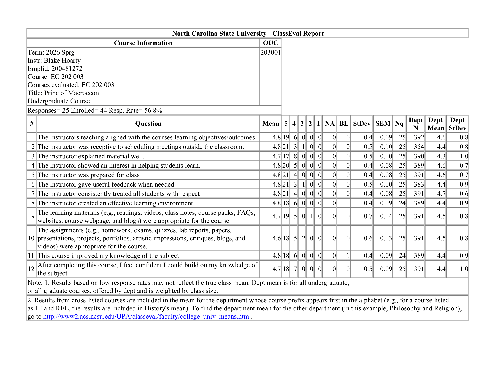
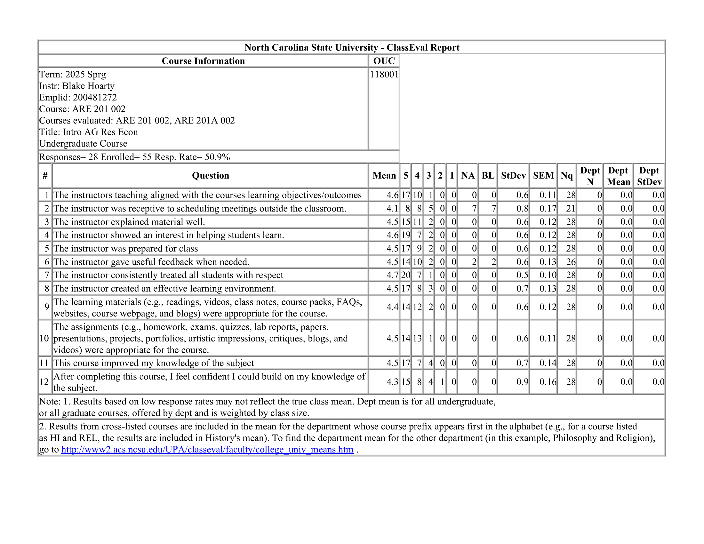

  <a href="index.html">Home</a>
  <a href="research.html">Research</a>
  <a href="teaching.html">Teaching</a>
  <a href="assets/Hoarty_CV.pdf">CV</a>
  <a href="assets/Hoarty_JMP.pdf">JMP</a>

# Teaching

## Instructor of Record

- EC 202: Principles of Macroeconomics, North Carolina State University (Spring 2024, Spring 2026)
- ARE 201: Introduction to Agricultural & Resource Economics, North Carolina State University (Spring 2025)

## Teaching Assistant

- EC 201: Principles of Microeconomics, North Carolina State University (Fall 2024)
- EC 202: Principles of Macroeconomics, North Carolina State University (Fall 2022, Spring 2023, Fall 2023)

## Selected Written Reviews 

- "One of the best and most helpful teachers I've ever had."
- "His teaching style was clear, approachable, and interactive, which made it easier to follow along and ask questions when needed. Overall, he created a positive learning environment that made a challenging subject feel more manageable and even enjoyable at times."
- "Blake was an excellent instructor who took the time to explain concepts well and answer any questions. He cared about every student's success and was very responsive to any issues with quizzes or tests."
- "He was entertaining and informative. Kept the class fun. I enjoyed having him as an instructor."
- "Mr. Hoarty was a great teacher. He created a comfortable learning environment, going at the students' pace so as not to overload them with information"

## Quantitative Teaching Evaluations

